# Project 

## Database Scheme


## Cara Menjalankan 
1. Clone repository ini terlebih dahulu 
```
git clone git@github.com:jonnjonnjo/presensi.git
cd presensi
``` 

2. Jalankan docker untuk menjalakan postgresql 
```
docker compose up -d
```
3. Buat `.env` berdasarkan `.env.example`. Anda tidak perlu mengganti default value dari setiap attribute pada `.env` 
```
cp .env.example .env 
```

4. Lakukan instalasi pada semua dependensi
``` 
npm i 
```
5. Jalankan `migration` terlebih dahulu untuk mengisi database PSql tersebut 
```
npx prisma migrate dev
```
6. Jalankan `seeding` untuk mengisi database tersebut dengan data dummy 
``` 
npx prisma db seed
```

7. Jalankan server express tersebut 
``` 
npm run dev -> change later into assuming production 
```

8. Buka dokumentasi swagger yang terdapat pada `localhost:6767/api-docs`


## Teknologi yang digunakan 
1. Node.js dengan Express framework sebagai framework Backend 
2. Typescript untuk membantu type-safety ketika pemgembangan aplikasi
3. PostgreSQL sebagai database 
4. Prisma ORM sebagai ORM untuk mempermudah pengembangan fitur-fitur yang terkait langsung dengan database 
5. Morgan untuk logging 
6. Docker untuk menjalankan PostgreSQl. Hal ini lebih mudah dibandingkan menggunakan PostgreSQL secara native 
7. Vitest untuk unit testing 
8. JWT (jsonwebtoken) untuk membantu autentikasi user 
9. Swagger (swagger-jsdoc + swagger-ui-express) untuk membantu dokumentasi serta testing API 
10. bcryptjs (hashing) untuk melakukan hashing pada kredentials JWT 
11. tsx untuk melakukan running kode typescript 


## Struktur Direktori 
```
.
├── assets
│   └── ERD.svg
├── prisma
│   ├── migrations
│   ├── schema.prisma
│   └── seed.ts
├── src
│   ├── generated/
│   ├── lib
│   │   └── prisma.ts
│   ├── middleware
│   │   ├── auth.ts
│   │   └── roles.ts
│   ├── routes
│   │   ├── admin.ts
│   │   ├── auth.ts
│   │   └── worker.ts
│   ├── __tests__
│   │   ├── routes
│   │   └── utils
│   ├── types
│   │   └── express.d.ts
│   ├── utils
│   │   └── response.ts
│   ├── app.ts
│   └── swagger.ts
├── docker-compose.yml
├── .env.example
├── package.json
├── prisma.config.ts
├── tsconfig.json
└── vitest.config.ts
```

## Penjelasan Desain Aplikasi 

## Kendala yang ditemui 
Berdasarkan 
