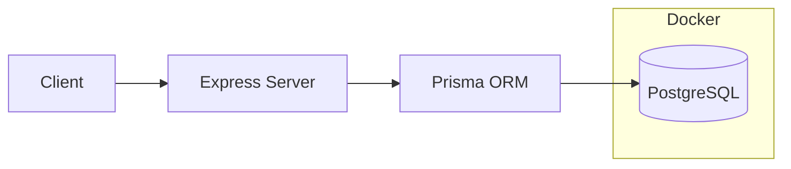

# Pusdatik Kemnaker Attendance

## Cara Menjalankan 
1. Clone repository ini terlebih dahulu 
```
git clone https://github.com/jonnjonnjo/presensi.git
cd presensi
``` 

2. Jalankan docker untuk menjalakan postgresql 
```
docker compose up -d
```
3. Buat `.env` berdasarkan `.env.example`. Anda tidak perlu mengganti default value dari setiap attribute pada `.env` 
```
cp .env.example .env 
```

4. Lakukan instalasi pada semua dependensi
``` 
npm i 
```
5. Jalankan migration terlebih dahulu untuk mengisi database PSql tersebut 
```
npx prisma migrate dev
```
6. Jalankan seeding untuk mengisi database tersebut dengan data dummy 
``` 
npx prisma db seed
```

7. Jalankan server express tersebut 
``` 
npm run dev
```

8. Buka dokumentasi swagger yang terdapat pada `localhost:6767/api-docs`

9. Anda dapat pula menjalankan Prisma GUI untuk melihat detail database dengan menjalankan 
```
npx prisma studio
```

10. Anda dapat mencoba menjalankan unit testing dengan menjalankan 
```
npm run test
```


## Teknologi yang digunakan 
1. `Node.js` dengan Express framework sebagai framework Backend 
2. `Typescript` untuk membantu type-safety ketika pengembangan aplikasi
3. `PostgreSQL` sebagai database 
4. `Prisma ORM` sebagai ORM untuk mempermudah pengembangan fitur-fitur yang terkait langsung dengan database 
5. `Morgan` untuk logging 
6. `Docker` untuk menjalankan PostgreSQl. Hal ini lebih mudah dibandingkan menggunakan PostgreSQL secara native 
7. `Vitest` dan `supertest` untuk melakukan unit testing 
8. `JWT` (jsonwebtoken) untuk membantu autentikasi user 
9. `Swagger` (swagger-jsdoc + swagger-ui-express) untuk membantu dokumentasi serta testing API 
10. `bcryptjs` (hashing) untuk melakukan hashing password user
11. `tsx` untuk melakukan running kode typescript 


## Struktur Direktori 
```
.
├── assets
│   └── ERD.svg
├── prisma
│   ├── migrations
│   ├── schema.prisma
│   └── seed.ts
├── src
│   ├── generated/
│   ├── lib
│   │   └── prisma.ts
│   ├── middleware
│   │   ├── auth.ts
│   │   └── roles.ts
│   ├── routes
│   │   ├── admin.ts
│   │   ├── auth.ts
│   │   └── worker.ts
│   ├── __tests__
│   │   ├── routes
│   │   └── utils
│   ├── types
│   │   └── express.d.ts
│   ├── utils
│   │   └── response.ts
│   ├── app.ts
│   ├── env.ts
│   └── swagger.ts
├── docker-compose.yml
├── .env.example
├── package.json
├── prisma.config.ts
├── tsconfig.json
└── vitest.config.ts
```

## Penjelasan Desain Aplikasi 

Aplikasi ini memiliki dua role: Worker dan Admin. Worker hanya dapat
melihat dan mengelola presensinya sendiri. Admin dapat melihat dan
mengelola seluruh data presensi. 

### Database Scheme
Berikut adalah skema dari database yang akan dipakai. Justifikasi pemilihan skema dan tipe data dijelaskan pada bagian [Kendala yang ditemui](#kendala-yang-ditemui).


### System Design




## Kendala yang ditemui 
Kebanyakan kendala-kendala yang saya temui hanyalah berdasarkan pada hal-hal yang tidak disebutkan secara eksplisit pada dokumen technical test. 
Berikut adalah asumsi-asumsi yang saya buat 
1. Saya melakukan normalization pada skema database yang dibuat menjadi 2 table yaitu User dan Presensi. Hal ini dikarenakan fungsi-fungsi bonus lainnya akan lebih mudah diimplementasikan jikalau database sudah dinormalisasi seperti pada bonus JWT ataupun bonus searching.
2. Saya mengasumsikan penggunaan-pengunaan nantinya akan dibedakan berdasarkan user dan admin. akan dibedakan berdasarkan user dan admin.
3. Saya asumsikan bahwa server akan di-host pada GMT+7 atau WIB sehingga saya secara eksplisit melakukan deklarasi pada docker untuk menggunakan GMT+7. 
4. Pagination, Filter & Searching, serta sorting akan lebih mudah dilakukan jika tabel yang awalnya hanya cuma 1 di-normalize menjadi 2. JWT juga akan lebih mudah di-manage apabila terdapat tabel User sendiri.
5. Saya asumsikan urusan account management pada table User bukanlah termasuk dalam scope ini 
6. Logging details saya buat dalam layar abstraksi setinggi mungkin, yaitu morgen('tiny'), dikarenakan saya hanya bisa membaca logging pada level tersebut.
7. Saya asumsikan bahwa lag/delay antar request dari client->server sekecil mungkin sehingga server dapat menggunakan waktu-bawaan untuk mengisi check-in dan check-out pada attribute di tabel.
9. Saya asumsikan check-in dan check-out hanya dapat terjadi pada satu hari yang sama sehingga kolom tersebut hanya menyimpan jam:detik saja
10. Akibat dari bonus soft-delete, setiap request yang ingin membuat request yang sebelumnya pernah di-delete maka harus melakukan proses `restore`. Hal ini karena terdapat conflict antara soft-delete yang tidak menghapus record serta rules  Unique[employee_id,attendance_date]
